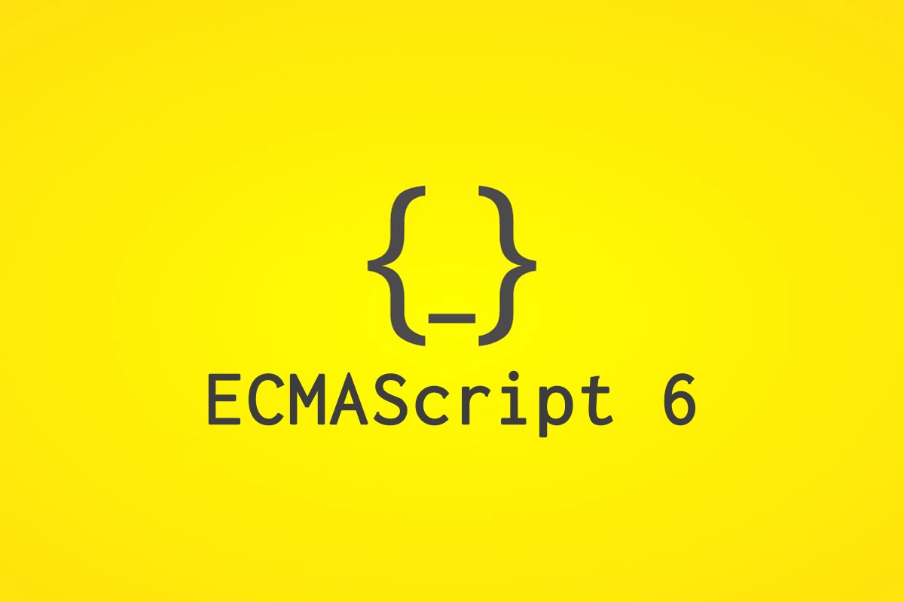

# Class Private Fields

Created: Oct 15, 2019 11:38 PM



# Old workarounds

- 일반적으로 `_`를 prefix로 덧붙여 이 필드가 Private이라고 표현함.
- 물론, 실제로 프로그래머가 얼마든 접근할 수 있었음. 그냥 규약일 뿐.
- 그 외에도 WeakMap, Symbol 등을 활용한 접근 방법이 있었음.
- 하지만 사용하기 까다롭고 클래스 문법이 복잡해짐.

    class Counter{
    	_count = 0;
    	increment(){
    		this._count++;
    	}
    }

# Private Fields Syntax

- `_`가 아닌 `#`을 prefix로 덧붙이면 Private Field가 됨
- 참조할 때도 마찬가지로 #을 덧붙여 사용하면 됨.
- 외부에서 접근할 경우 Syntax Error.
```
    class Counter{
    	#count = 0;
    	increment(){
    		this.#count++;
    	}
    }
```
# Browser Support

- TC39 Proposal Stage 3
- 현재로서는 Chrome만 지원
- 하지만 Babel을 통해 사용하실 수 있습니다.
- 실제 Babel도 내부적으로는 WeakMap을 통해 구현되어 있음.