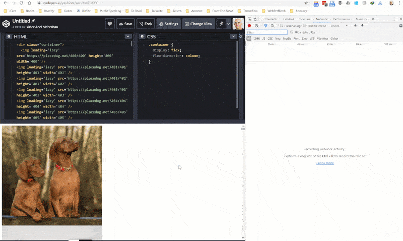
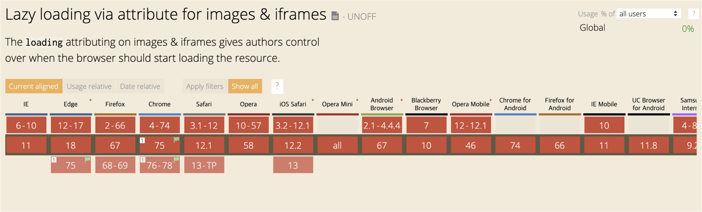

# Native Lazy Loading

Created: Oct 15, 2019 10:27 PM

# What is lazy loading?

- 페이지 내 현재 중요하지 않은 리소스의 로드를 늦추는 기술
- 일반적으로 이미지나 비디오 등의 큰 데이터들을 “필요할 때” 로드하는 것을 말함
- 지금까지는 JavaScript의 IntersectionObserver, 혹은 scroll 위치를 보고 구현했음
- lazy loading 을 이용시 보이는 이미지들만 출력하고 안보이는 이미지들을 206 상태로 대기시킴

# Image Common Loading

# Image Lazy Loading

# 

    -
    <iframe src="video-player.html" loading="lazy"></iframe>

# Browser Support

# Example

[https://addyosmani.com/blog/lazy-loading/?q=io](https://addyosmani.com/blog/lazy-loading/?q=io)

[https://mathiasbynens.be/demo/img-loading-lazy](https://mathiasbynens.be/demo/img-loading-lazy)