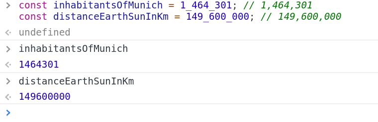

# Numeric Separator / BigInt

Created: Oct 19, 2019 7:58 AM


# Numeric Separator
```
    const inhabitantsOfMunich = 1_464_301; // 1,464,301
    const distanceEarthSunInKm = 149_600_000; // 149,600,000
```


# Unreliable result & BigInt


# Type Casting
```
    const bigInt = 12345678912n * 12345678912n
    const num = Number(bigInt)
    const bigInt2 = BigInt(num)
```
# Browser Support

- Numeric Separator의 경우 Chrome만 지원하고 있음
- 하지만 babel에서 지원하고 있음 (@babel/plugin-proposal-numeric-separator)
- TypeScript도 2.7부터 지원
- BigInt도 Chrome만 지원 중
- JSBI:JavaScript BigInt 구현체
- Babel을 이용해서 JSBI를 Polyfill로서 사용할 수 있음