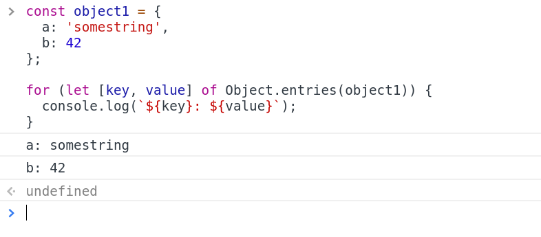
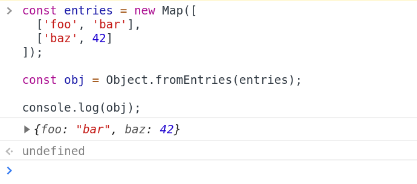

# Object.fromEntries

Created: Oct 19, 2019 8:08 AM


# Object.entries()
```
    const object1 = {
      a: 'somestring',
      b: 42
    };
    
    for (let [key, value] of Object.entries(object1)) {
      console.log(`${key}: ${value}`);
    }
```


# Object.fromEntries()
```
    const entries = [
      ['foo', 'bar'],
      ['baz', 42]
    ]
    
    const obj = Object.fromEntries(entries);
    
    console.log(obj);
```


# Browser Support

- Edge를 제외한 대부분의 모던 브라우저에서 지원됨
- 물론 Polyfill 가능(core-js)