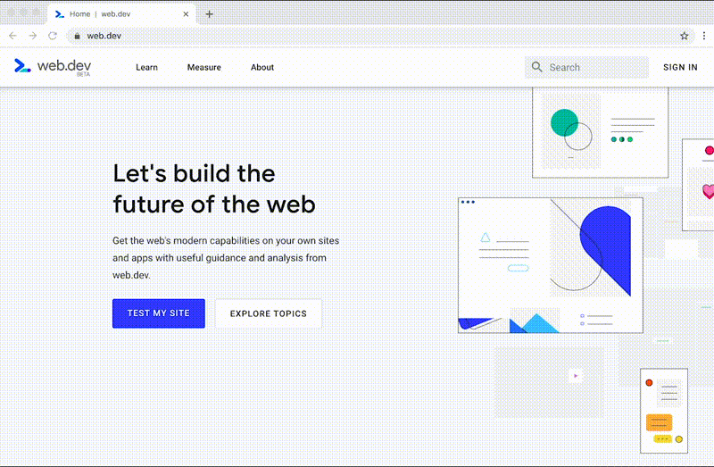
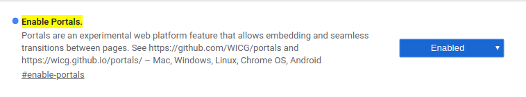

# Portals

Created: Oct 15, 2019 10:27 PM



# What Portals?

`<iframe/>` 와 비슷하게 한페이지에서 다른 url 로 미리보고 전환하는 기술 

# Differences with `<iframe/>`

- 임베드한 페이지로 이동하는 기능이 제공 됨
- 임베드한 페이지로 이동할 때 컨텐츠를 다시 로드하지 않음
- postMessage로만 통신 가능
- 브라우징 컨텍스트가 항상 Top-level임

# Example Code
```
    // Create a portal with the wikipedia page, and embed it
    // (like an iframe). You can also use the <portal> tag instead.
    portal = document.createElement('portal');
    portal.src = 'https://en.wikipedia.org/wiki/World_Wide_Web';
    portal.style = '...';
    document.body.appendChild(portal);
    
    // When the user touches the preview (embedded portal):
    // do fancy animation, e.g. expand …
    // and finish by doing the actual transition
    portal.activate();
```
# Portals 활성화 방법

크롬창에 chrome://flags/#enable-portals 입력후 Enable Portals 활성화



# 예제

[https://web.dev/hands-on-portals](https://web.dev/hands-on-portals)

[https://uskay-portals-demo.glitch.me/](https://uskay-portals-demo.glitch.me/)