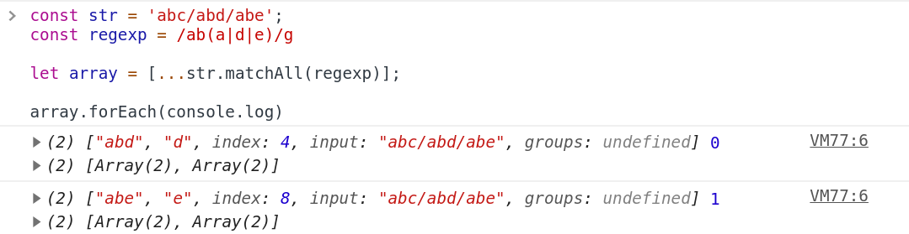

# String.prototype.matchAll

Created: Oct 19, 2019 7:44 AM

# String.prototype.match

    const str = 'abc/abd/abe';
    
    const reg = /ab(a|d|e)/g
    
    str.metch(reg) // ['abc','abd','ade']

# String.prototype.matchAll

    const str = 'abc/abd/abe';
    const regexp = /ab(a|d|e)/g
    
    let array = [...str.matchAll(regexp)];
    
    array.forEach(console.log)

Browser Support

- ES2020
- Chrome / Firefox 지원
- Polyfill을 사용하실 수 있습니다. (core-js)