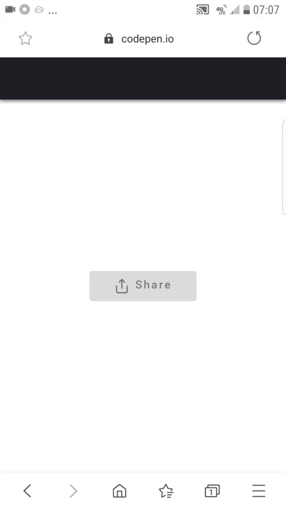
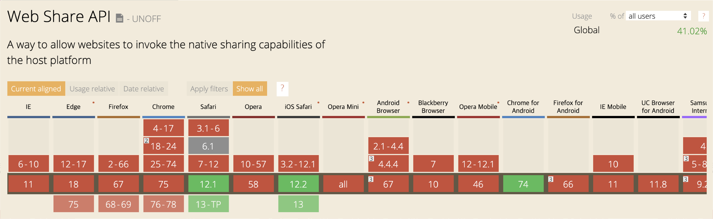

# Web Share API

Created: Oct 15, 2019 10:27 PM



출처 : [https://ui.toast.com/weekly-pick/ko_20190618/](https://ui.toast.com/weekly-pick/ko_20190618/)

# Web Share API?

- Web Share API는 안드로이드 Chrome 61 버전에서 처음 소개
- Web Share API는 기기의(혹은, Safari를 사용하는 데스크탑의) 링크나 연락처 카드 등의 컨텐츠를 네이티브 공유 다이얼로그를 열어주는 방법을 제공해준다.

# navigator.share()
```
    shareButton.addEventListener('click', event => {
      if (navigator.share) {
        navigator.share({
          title: 'WebShare API Demo',
          url: 'https://codepen.io/ayoisaiah/pen/YbNazJ'
        }).then(() => {
          console.log('Thanks for sharing!');
        })
        .catch(console.error);
      } else {
        shareDialog.classList.add('is-open');
      }
    });
```
# Browser Support



# Example

[https://stackblitz.com/edit/iox-share-example](https://stackblitz.com/edit/iox-share-example)

[https://css-tricks.com/how-to-use-the-web-share-api/](https://css-tricks.com/how-to-use-the-web-share-api/)