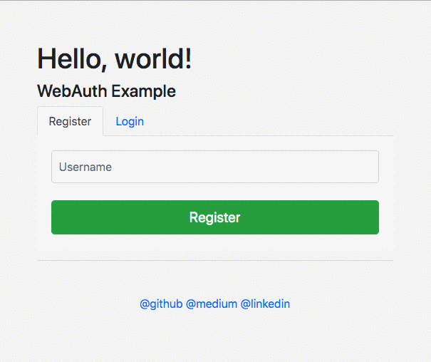
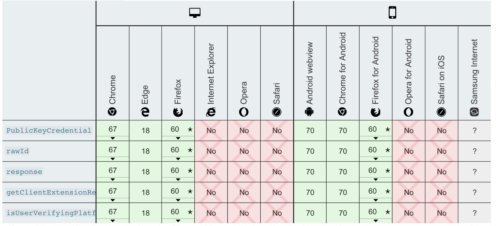

# WebAuthn

Created: Oct 15, 2019 11:25 PM

출처 : [https://medium.com/@hto/webauthn-simple-demo-golang-efba1c6507c9](https://medium.com/@hto/webauthn-simple-demo-golang-efba1c6507c9)

# What is WebAuthn?

- Based on Credential Management API
    - 간단히 말하면, 웹에서의 자동완성을 위한 JavaScript API
- WebAuthn은 Credential Management API의 “공개키 버전”
- 2-Factor Authentication for Web

# How it works?

- Challenge – Response Protocol
- 클라이언트에서 보유한 토큰을 이용해 Public – Private Key 생성
- 서버는 Public Key를 보유, 클라이언트는 Private Key를 보유
- 매 로그인 시마다 서버는 챌린지 값 생성
- 챌린지 값과 Private Key를 기반으로 클라이언트가 시그니처를 생성
- 서버에서 Public Key를 이용해 시그니처를 검증

# Browser Support

# Example

[https://webauthn.io/](https://webauthn.io/)

[https://webauthn.guide/](https://webauthn.guide/)