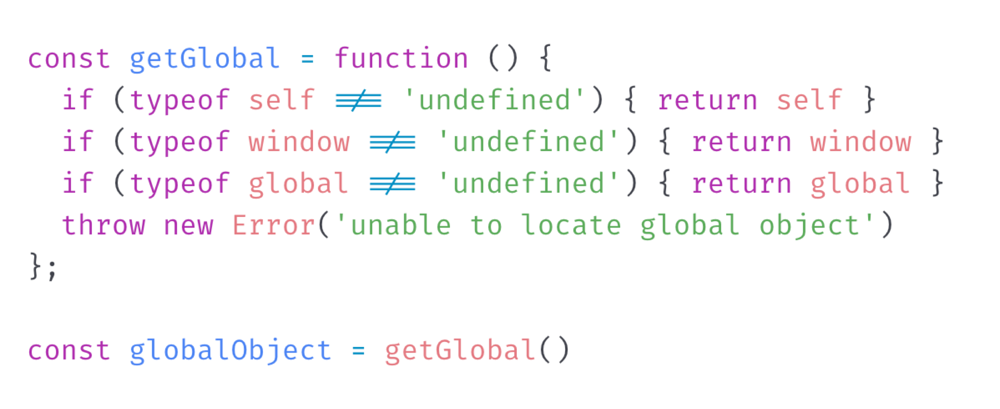
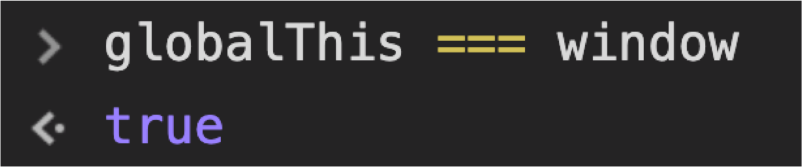
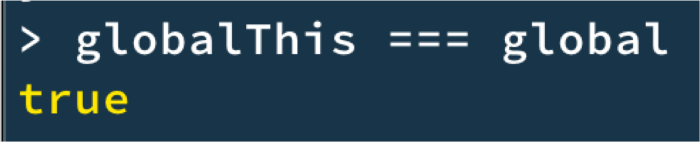

# globalThis

Created: Oct 19, 2019 8:13 AM

# Cross-platform problem

- JavaScript가 사용되는 곳은 브라우저 뿐만이 아님
- 문제는 각 플랫폼 별로 Global 객체가 가지고 있는 이름이 서로 다름
- e.g.) Browser에서는 `window`, Node.js에서는 `global`

# Chrome Console

# Node.js REPL

# Browser Support

- Edge를 제외한 대부분의 모던 브라우저에서 구현되어 있음
- 대충 열 줄 정도의 코드로도 Polyfill 가능.
- npm install @ungap/global-this